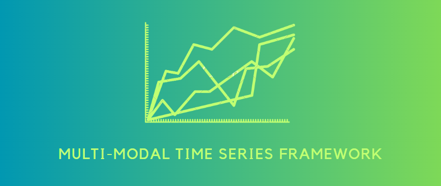

# Multimodal Deep Learning for Industrial Process Monitoring Using the Example of Stamping and Press-in Processes

<p align="center">
  
</p>

<div align="center">


[](https://www.python.org/downloads/)
[](https://pytorch.org/)
[](https://optuna.org/)
[](https://scikit-learn.org/)
[](https://www.tensorflow.org/)

</div>

## Project Overview

This project is a multi-modal time series analysis project that involves two different modalities: Force and Acceleration. This repository contains code and documentation related to data processing, analysis, and modeling of time series data from these modalities.

## Objective

The main objective of this project is to perform in-depth time series analysis on data from two different modalities: Force and Acceleration. This involves data preprocessing, feature engineering, modeling, and hyperparameter optimization. The project aims to achieve the following:

- Gain insights and understanding of the data from both modalities.
- Develop and optimize machine learning models for each modality.
- Explore the potential benefits of combining information from both modalities (multimodal analysis).
- Share the results and findings in a clear and informative manner.

## Project Structure

The project is organized into the following directories and files:

- **01_Pre_Process_Notebooks**
  - Jupyter notebooks for initial data pre-processing.
- **02_Optuna_Runs**
  - Contains subdirectories for different types of data like `acceleration`, `force`, `force_press_in`, `multimodal`, and a SQLite database for Optuna results.
- **03_Supervised_Notebooks**
  - Jupyter notebooks for supervised learning cases, including `acceleration_cases`, `force_cases`, `force_press_in_case`, and `multimodal_cases`.
- **04_Iterative_Dataset_Expansion_Evaluation**
  - Evaluation notebooks and data for iterative dataset expansion.
- **05_Semi_Supervised - Fix Match**
  - Notebooks for semi-supervised learning approaches for `Acceleration`, `Force`, `Force_Press_In`, and `Multimodal`.
- **06_Visualization_Notebooks**
  - Jupyter notebooks for visualization purposes.
- **07_Supervised_Notebooks_50_Percent**
  - Supervised Notebooks with 50% train dataset.
- **artifacts**
  - Contain pth files of every model.
- **data**
    - **raw_data** (Ignored in Git): This folder contains the raw data used in the project. It is typically ignored in version control systems like Git due to its large size.
    - **processed_data**: This folder contains processed and pre-processed data that is used for analysis and modeling.
- **results**
  - This directory stores the project's results, which can include model outputs, graphs, and other relevant files.
- **src**
  - Contains the source code modules for the project, organized as follows:
    - **multimodal**: Module for multimodal data handling and processing.
    - **semi_supervised**: Module for semi-supervised learning methods.
    - **visualization**: Module for data visualization and results representation.

## Getting Started

To get started with this project, follow these steps:

1. Clone the repository to your local machine:

   ```bash
   git clone https://github.com/andi677/AI-FAPS_Hassan_Ahmed.git
   ```
2. Navigate to the project directory:

   ```bash
   cd AI-FAPS_Hassan_Ahmed
   ```
3. Create and activate a virtual environment:

   ```bash
    # For Windows:
    python -m venv .aifaps
    venv\Scripts\activate

    # For macOS and Linux:
    python3 -m venv .aifaps
    source venv/bin/activate
   ```
4. Install project dependencies:

   ```bash
   pip install -r requirements.txt
   ```
5. Verify installation:

   ```bash
   pip list
   ```
6. Deactivate the virtual environment (optional):

   ```bash
   deactivate
   ```

## Version Control Steps:

Before Pushing into your branch update **requirements.txt** file and then commit and push using following commands.

```
pip freeze | cut -d'=' -f1 > requirements.txt

git add .
git commit -m "commit message"
git push origin branch_name

```
